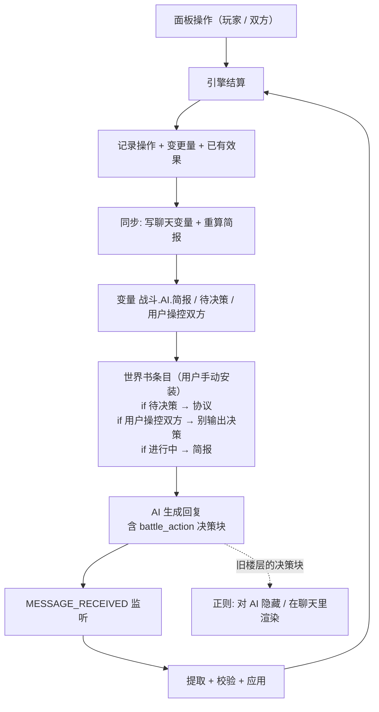

# AI 战斗协议

让 AI 以「最小上下文」参与卡牌战斗：脚本只把**当前回合该知道的信息**注入提示词，AI 只需输出一个标准格式的决策块，脚本负责校验与结算。

---

## 1. 目标与约束

| 约束 | 做法 |
| --- | --- |
| AI 上下文很长，不能塞整局战斗 | 只注入「本回合简报」，完整快照留在变量里不注入 |
| AI 输出必须可被引擎读取 | 固定 `<battle_action>` JSON 协议 + 服务端二次校验 |
| 酒馆预设已规定 AI 行为 | 用**世界书条目**注入系统命令，而不是改预设 |
| 不能长期污染上下文 | 条目内容用 `{{if}}` 判定，不在战斗中时渲染为空；条目由用户手动安装，脚本不自动注入 |
| 旧决策不应反复出现在提示词里 | 用**正则**在提示词侧抹掉旧决策块，同时保留聊天里可读 |

---

## 2. 数据流



两种会话模式：

| 模式 | 写聊天变量 | 世界书生效 | AI 决策 | 两边可操作 |
| --- | --- | --- | --- | --- |
| `BATTLE` 正式战斗 | 是 | 是 | 敌方回合输出决策块 | 仅当开启「双方操控」 |
| `PRACTICE` 演习 | **否** | **否** | 不参与 | 随时两边都可以 |

演习完全不碰变量，所以世界书条目的 `{{if}}` 全部为假，AI 不会收到任何战斗信息（要求 5）。

---

## 3. 变量布局

聊天变量（每个对话独立）：

```
战斗
├─ 出战卡组            # 由「卡组」面板写入
└─ AI
   ├─ 版本             # 数据格式版本
   ├─ 进行中           # 是否有未结束的战斗
   ├─ 回合 / 行动方
   ├─ 待决策           # 未结束 且 行动方是 AI 且未开双方操控 → 协议块的开关
   ├─ 用户操控双方     # 玩家同时操作两边 → 另一段提示词告诉 AI 别输出决策
   ├─ 简报             # 注入给 AI 的紧凑文本（非战斗/非 AI 回合为空）
   ├─ 本回合操作       # 玩家与 AI 这回合做过的事（旧→新），会进简报
   ├─ 局面             # 引擎快照，仅用于续战，绝不注入
   ├─ 配置             # 重建战斗所需参数
   ├─ 日志             # 最近 40 条战斗日志
   └─ 结果             # 上一次 AI 决策的结算结果（面板展示用）
```

- 写入方式：`updateVariablesWith(vars => { _.set(vars, '战斗.AI', store); return vars; }, { type: 'chat' })`
- 读取方式：`_.get(getVariables({ type: 'chat' }), '战斗.AI')` → `BattleAIStoreSchema.parse(...)`
- 结构定义在 `src/卡牌系统/战斗/schema.ts`；`ChatVariableSchema` 是**合并后**的整体结构（`卡组` + `战斗`），因为 `registerVariableSchema` 对同一类型是后者覆盖前者。

---

## 4. 世界书条目（用户手动安装）

**脚本不会自动创建/删除世界书条目，也不会自动改用户的任何东西。**
需要用户自己装一次：

### 方式 A：导入 JSON（推荐）

1. 在工作区根目录拿到 `世界书-卡牌战斗.json`（由 `node src/卡牌系统/战斗/生成世界书.ts` 生成）；
2. 酒馆 →「世界书」→ 导入，会得到一个名为 `卡牌战斗` 的世界书；
3. 把它绑定为**全局世界书**（或角色/聊天世界书），确保它在战斗对话里处于开启状态。

装在全局也不会污染其它对话：条目的 `{{if}}` 判的是**当前聊天**的变量，不在战斗中就直接渲染为空。

### 方式 B：手动新建条目

在世界书里新建条目 `[战斗]敌方回合决策`，蓝灯（constant），内容直接粘：

```
{{if {{get_chat_variable::战斗.AI.待决策}}}}
<固定协议文本，由 协议.ts 的 protocolText() 生成>
{{/if}}
{{if {{get_chat_variable::战斗.AI.用户操控双方}}}}
<双方操控提示词，由 协议.ts 的 bothSidesNote() 生成>
{{/if}}
{{if {{get_chat_variable::战斗.AI.进行中}}}}
【本回合简报】
{{format_chat_variable::战斗.AI.简报}}
{{/if}}
```

三段各自独立判定：

- 轮到 AI 决策 → 注入决策协议；
- 玩家同时操控两边 → 只注入「不要输出决策块」的说明（否则 AI 会和玩家抢着行动）；
- 战斗进行中 → 注入局面简报（含双方已有效果、数值变更量、最近操作）。

### 条目字段

| 字段 | 值 | 原因 |
| --- | --- | --- |
| `strategy.type` | `constant` | 蓝灯，稳定注入，不依赖关键词 |
| `position` | `at_depth` / `system` / `depth 0` / `order 100` | 作为系统命令出现 |
| `probability` | `100` | 不要随机 |
| `recursion` | 全部关闭 | 不需要递归扫描 |
| `effect` | 全 `null` | 不需要 sticky / cooldown |

### 为什么用 `{{if}}`

酒馆官方宏文档明确支持嵌套：`{{if {{getvar::x}}}}...{{/if}}`（内层宏先求值），假值包括空串、`false`、`0`、`off`、`no`。
所以「不在战斗中 / 不是 AI 回合」时整条内容渲染为空，**完全不占上下文**。

> ⚠️ 运算符必须写在**嵌套宏内部**（例如 `{{if {{.status == active}}}}`）。条件正则到第一个 `}}` 就结束，别在嵌套宏外面再写 ` == true`。

### 为什么用 `format_chat_variable` 而不是 `get_chat_variable`

| 宏 | 返回 | 多行文本 |
| --- | --- | --- |
| `{{get_chat_variable::路径}}` | `JSON.stringify(value)` | 换行变成 `\n` 转义，AI 读到一坨 |
| `{{format_chat_variable::路径}}` | `YAML.stringify(value).trimEnd()` | 变成 YAML 块标量（`\|-` + 原始行），换行保留 |

简报是多行文本，所以必须用 `format_`。

### 更新与检查

- 协议改动时 `PROTOCOL_VERSION` +1，并重新运行 `node src/卡牌系统/战斗/生成世界书.ts`，让用户重新导入覆盖；
- 代码里提供了两个**只读/显式**接口，默认流程都不会自动调用：
  - `checkBattleWorldbook()`：扫描所有世界书，告诉面板条目装在哪、是否需要更新；
  - `installBattleWorldbook(name?)`：仅当面板上有一个明确的「安装」按钮时才调用。

---

## 5. 决策块协议

AI 回复正文里附带：

```xml
<battle_action>
{"回合": 3, "操作": [
  {"do": "play", "card": "c9"},
  {"do": "attack", "card": "c5", "target": "c21"},
  {"do": "activate", "card": "c7", "effect": "study"}
]}
</battle_action>
```

| 操作 | 字段 | 说明 |
| --- | --- | --- |
| 上场 | `{"do":"play","card":"c9"}` | `card` 用简报里的实例 id（`c1`…）；要花能量（简报里写「N费」） |
| 攻击 | `{"do":"attack","card":"c5","target":"c21"}` | `target` 是卡牌实例 id 或 `PLAYER`；打脸受**守卫**限制（见下） |
| 发动 | `{"do":"activate","card":"c7","effect":"study"}` | `effect` 是效果 id |
| 回答 | `{"do":"answer","ask":"询问id","cards":["c3"]}` | 回答简报里的「需要你回答」；`ask` 可省略（默认回答当前那条） |
| 弃牌 | `{"do":"discard","cards":["c3"]}` | 手牌超上限时弃牌的简写（等同上面那条，只用于弃牌） |
| 结束 | `{"do":"end"}` | 可省略，操作执行完会自动结束回合 |

#### 能量（通用费用）

- 卡牌的 `能量` 字段是「上场要花多少能量」，简报里手牌写 `N费 卡名 …`，玩家面板左上角也有一个黄色数字角标；
- 简报里写 `能量 x / y`（当前 / 本回合上限，0 就是没开能量），每次轮到自己行动时**补满**，上限随回合数按配置增长；
- 能量不足时 `play` 会被跳过并在结果里写明原因（`能量不足 (需要 N, 只有 M)`），AI 只能在能量够的时候上场；
- 名字故意取通用的「能量」，因为这套脚本会被不同角色卡共用；
- 上场价会把**洗牌加价**算进去（见下），所以同一张卡在后期的价格可能比卡面高。

#### 战斗规则（守卫 / 抽牌 / 溢出传伤 / 洗牌代价 / 回合上限）

这几条写在开战设置里（面板「高级设置」），会随着简报一起告诉 AI（简报里的 `战斗规则:` 行），
因为「为什么打不了脸 / 怎么变贵了」不写清楚的话 AI 只能靠猜：

| 规则 | 默认 | 说明 |
| --- | --- | --- |
| 每回合抽牌 | 1 | 每方**轮到自己行动的瞬间**抽牌；先手方第 1 回合不抽（先手补偿）。设 0 就退回「只在开局发牌」 |
| 守卫 | 开 | 对手场上还有卡时，普通攻击（`ATTACK`）**打不到他本人**；被挡下不消耗攻击次数，也不造成伤害。卡面写「无视守卫」的效果用 `"ignore_guard": true` 越过；`DAMAGE` 这类**效果伤害**不受守卫限制（那是破防的出口） |
| 溢出传伤 | 0.5 | 打死一张卡时，超出它剩余生命的伤害按比例传给它的控制者。于是「清场」本身也在推进度，不必先把场清完才能碰到对手本人 |
| 洗牌上限 / 加价 | 不限 / 1 | 牌库抽空时把墓地洗回牌库（`牌库轮换: 墓地洗回`）；每洗一次该方**之后上场**的卡永久 +N 能量，且最多只能洗 N 次（用完就真的抽不到牌） |
| 回合上限 | 30 | 打满这么多回合还没分胜负，就按双方**剩余生命比例**判定（比例相同算平局）。设 0 = 不限 |

守卫在面板侧同样生效：挡着的时候敌方头像不再是合法目标，选中卡片的提示条会写「对手场上还有卡, 暂时不能直接打脸」。

#### 带标记的重要效果与「需要你回答」

有些机读效果写了 `ask: true`（例如「守夜人」的 `守夜`），它们不会自己发动：

- 简报里会多一段 `需要你回答:`，列出待回答的询问（弃牌 / 批准某个效果 / 让 AI 决定是否反击）；
- 弃牌用 `discard` / `answer` 回答，批准效果在 `attack` / `activate` 里补 `"answers":["效果id"]`（`[]` = 不发动）；
  收手时才触发的这类效果（`SIDE_END` / `TURN_END`）写在决策块**最外层**：`{"answers":["值夜"],"操作":[...]}`，
  因为「结束行动」这条操作是脚本自动补上的，没地方挂单条答案；
- **不回答就按卡上的 `ask_default` 处理**：`RUN` 默认发动，`SKIP` 默认不发动，引擎会记一条 `这次没有发动` 的日志；
- 面板侧同理：玩家在 UI 弹窗里选，弹窗上还有一个「交给引擎自动弃牌 / 都不发动」的快捷按钮。

校验规则（`决策.ts`）：

1. 取**最后一个**决策块（AI 可能先推理再给结论）；容忍代码围栏、裸数组、`操作/actions/ops`、`回合/turn` 等写法；
2. 整块拒绝：不是 AI 回合、战斗已结束、`回合` 与当前回合不符、操作数 > 8、JSON 不合法；
3. 逐条跳过：卡牌不存在、能量不足、不满足上场/攻击/发动条件 → 记录原因，不整块失败；
4. 执行完自动 `endTurn()`；空数组等于过回合。

---

## 6. 正则清理（导入到酒馆的 JSON）

工作区根目录两个文件，在酒馆「正则」里导入即可：

| 文件 | 作用 | 关键字段 |
| --- | --- | --- |
| `regex-卡牌战斗决策-对ai隐藏旧决策.json` | 提示词侧抹掉旧决策块 | `promptOnly: true`、`markdownOnly: false`、`minDepth: 2` |
| `regex-卡牌战斗决策-渲染旧决策.json` | 聊天里把旧决策渲染成折叠块 | `markdownOnly: true`、`promptOnly: false`、`minDepth: 2` |

- `minDepth: 2` = 只作用于「2 楼以上」的楼层，最新一轮的决策块保持原样（AI 刚写的那条）；
- 两个正则互不干扰：`promptOnly` 只改发给 AI 的副本，`markdownOnly` 只改聊天显示的副本；
- 结果：AI 看不到旧决策（省上下文、避免被自己的历史决策带跑），玩家却能在聊天里回看每一步。

---

## 7. 代码结构

```
src/卡牌系统/
├─ index.ts              # 脚本入口：注册 4 个面板按钮 + 「清空角色数据」
├─ 重置.ts               # 「清空角色数据」的实现（警告弹窗 → 清命名空间）
├─ 卡牌/                 # 「卡牌库」面板：卡牌定义编辑与校验
├─ 卡组/                 # 「卡组」面板：卡组编辑与出战
├─ 引擎/                 # 纯函数战斗引擎（battle / operations / rng / effects …）
│   │                    #   含能量与询问（listAsks / resolveAsk / canPayEnergy）
├─ 共用/
│   ├─ 外观.ts           # 面板外观设置（垫底色 / 模糊半径，各面板共享一份）
│   ├─ 弹窗.ts           # 弹窗外壳与确认框
│   └─ 通知.ts           # toastr 提示条封装 + 通知留档（供调试面板回看）
├─ 调试/
│   ├─ 数据.ts           # 三个作用域的变量占用量测（纯函数，可测）
│   └─ App.vue           # 全局调试面板（变量占用 + 通知留档）
└─ 战斗/                 # 本文档重点
    ├─ schema.ts         # 变量结构（战斗.AI，含 回放）+ 合并的 ChatVariableSchema
    ├─ 简报.ts           # 引擎状态 → 紧凑简报（纯函数，可测）
    ├─ 决策.ts           # 回复 → 决策块 → 引擎操作（纯函数，可测）
    ├─ 回放.ts           # 起点快照 + 步骤 → 重演出任意时刻（纯函数，可测）
    ├─ 协议.ts           # 固定协议文本 + 双方操控提示词 + PROTOCOL_VERSION
    ├─ 世界书.ts         # 生成世界书条目内容 / 可导入 JSON；不自动注入
    ├─ 生成世界书.ts     # 写出 世界书-卡牌战斗.json（手动运行）
    ├─ 同步.ts           # 变量读写、会话恢复、消息监听、步骤记录与回退
    ├─ 调试.ts           # 面板 → AI 的注入文本 / AI 回复的提取结果（纯函数，可测）
    ├─ App.vue           # 战斗操作面板（独立浮层）
    ├─ components/
    │   ├─ BattleCard.vue    # 战斗中单张卡（紧凑展示）
    │   ├─ ReplayViewer.vue  # 回溯弹窗（列出每一步，可退回到任意一步之前）
    │   └─ DebugViewer.vue   # 调试弹窗（注入文本 / AI 回复 / 回放 / 变量快照）
    └─ 测试.ts           # node 可直接跑：node src/卡牌系统/战斗/测试.ts
```

`同步.ts` 对外 API：

| 函数 | 用途 |
| --- | --- |
| `startBattleSession(setup)` | 开正式战斗并同步变量 |
| `startPracticeSession(setup)` / `resetPracticeSession()` | 开/重开演习（不写变量） |
| `getBattleState()` / `isBattleRunning()` / `isBattleWaitingForAI()` | 读状态（刷新后自动从变量恢复） |
| `getSessionMode()` / `isPracticeMode()` / `isControllingBothSides()` | 面板状态 |
| `canOperate(side)` | 某方此刻能不能操作（演习两边都行；正式战斗需轮到自己或开双方操控） |
| `operatePlay / operateAttack / operateActivate / operateEndTurn` | 双方通用操作（自动记操作 + 同步）；攻击 / 发动 / 结束行动都可多带一个 `answers`（询问回答） |
| `operateResolveAsk(side, ask_id, card_ids)` | 回答「弃牌」类询问（把选中的手牌弃进墓地） |
| `listSideAsks(side)` / `listSideAskable(side, timings)` | 面板用：待回答的询问 / 该方此刻会被询问的效果 |
| `playerPlayCard / playerAttack / playerActivate / playerEndTurn` | 上面四个的玩家（PLAYER）包装 |
| `setControlBothSides(enabled)` | 切换「双方操控」开关并重算待决策 |
| `syncBattle()` | 引擎状态变化后同步变量（演习直接返回，不写任何变量） |
| `installBattleDecisionListener()` | 监听楼层事件：结算 AI 决策、变动后回退重演 |
| `requestAIDecision()` | 主动触发一次生成（`/trigger`），需用户点击 |
| `endBattleSession()` | 结束会话（演习直接丢弃；正式战斗清快照） |
| `getSessionSteps()` / `getSessionDropped()` / `getSessionOps()` | 回放步骤与操作记录（旧 → 新） |
| `battleReplayReport()` | 回放体检（重放一遍与当前局面比对，带缓存） |
| `rewindToStep(keep)` | 面板「回溯」：退到第 keep 步之前 |
| `rewindForMessage(message_id, trigger)` | 楼层变动时退到该楼层之前（带提示条） |
| `battleWorldbookStatus()` | 只读检查世界书条目是否已安装 / 是否过时 |
| `readBattleStore()` / `describeDecisionResult()` | 面板展示用 |

### 接入面板

面板已经在脚本入口接好（`src/卡牌系统/index.ts`）：

```ts
import BattleApp from './战斗/App.vue';
import { ChatVariableSchema } from './战斗/schema';
import { installBattleBridge } from './战斗/同步';
import DebugApp from './调试/App.vue';

// panel_options 里:
//   战斗: name '战斗' / close_event 'card-battle-close'
//         keydown_namespace 'card-battle' / schema ChatVariableSchema / schema_type 'chat'
//   调试: name '调试' / close_event 'card-debug-close'
//         keydown_namespace 'card-debug' / 不绑变量（can_open 恒真）
await installBattleBridge();          // 恢复会话 + 安装监听 + 同步
```

---

## 8. 战斗操作面板

**独立浮层**，不往聊天记录里写任何界面（要求 1、2）。聊天里只会出现 AI 自己的决策块（由正则渲染成折叠块）。

### 布局

- 上：敌方头像行（HP / 手牌数 / 牌库 / 墓地 / 结束回合）+ 敌方场地 + 敌方手牌；
- 中：回合指示条；
- 下：我方场地 + 我方头像行 + 我方手牌；
- 底部操作栏：当前选择 / 动作按钮 / 「让 AI 行动」/ 退出。

卡牌用 `components/BattleCard.vue` 渲染（稀有度配色与卡牌库一致），显示当前值、与卡面基础值的差额、HP 条、持续状态（层数 + 剩余回合）。

### 操作方式

| 想做的事 | 拖放（电脑） | 点击（手机） |
| --- | --- | --- |
| 手牌上场 | 拖到场地空格 | 点手牌 → 点空格 |
| 普通攻击 | 拖自己的场上卡到敌方卡 / 敌方头像 | 点自己的卡 → 点目标 |
| 发动技能 | 点卡 → 选技能 → 拖到目标 | 点卡 → 选技能 → 点目标（或「发动技能」按钮） |

- **拖牌到目标上 = 对该目标普通攻击**（要求 6）；
- **点牌选技能后拖到目标 = 对目标发动技能**（要求 7）；
- 技能不需要目标的（如 `target: SELF`）可直接点「发动技能」。

### 能量与询问弹窗

- 头像行上有一行黄色 `能量 x / y`（仅开启能量时显示），手牌左上角有费用角标；
  能量不够或场上已满的手牌会变暗并禁止拖出，悬停提示原因（`能量不足 (需 4, 剩 1)` / `场上已满` / `不在手牌`）；
- 设置里有「上场消耗能量」（总开关）/「行动时补满能量」两个开关，以及手牌上限 / 起始能量 / 每回合增长 / 能量上限四个数字；
- 「高级设置」里还有生命 / 开局手牌 / 场上上限 / 随机种子 / 先手 / 牌库轮换，以及上面那张表里的战斗规则
  （每回合抽牌 / 洗牌上限 / 洗牌加价 / 「场上还有卡就不能打脸」/ 溢出传伤比例 / 回合上限）；
- **询问弹窗**：手牌超上限要弃牌（或机读区写了 `ask: true` 的重要效果）时，面板会弹出选择框，
  弃牌选够张数才能点确定，还有一个「交给引擎自动弃牌 / 都不发动」按钮（等于用卡上的 `ask_default`）；
  弹窗同一时刻只显示一条，按顺序处理，不会堆叠。

### 拖放开关与窄屏（要求 8）

- 设置里可关闭「启用拖放操作」，关闭后只能「点牌 → 选动作 → 点目标」；
- 视口窄于 900px（手机）时**自动关闭拖放**，用户仍可手动重新打开；
- 视口测量用的是**父窗口** `matchMedia`（脚本跑在 0×0 的隐藏 iframe 里，自身 matchMedia 永远命中窄屏）。

### 双方操控（要求 4）

设置里的「双方操控」开关（`战斗.AI.用户操控双方`）：

- 打开后玩家可以操作敌方，且 `待决策` 恒为 `false`；
- 世界书条目改注入 `bothSidesNote()`，明确告诉 AI **不要输出决策块**，避免它和玩家抢着行动；
- 关闭后恢复「AI 只控敌方」。

### 演习模式（要求 5）

- 配置界面上的「演习模式」按钮：用同一份配置开一局，**完全不写聊天变量**；
- 因此世界书三个条件块全为假 → AI 不知道有这场战斗，也不会被要求决策；
- 演习中两边随时可操作，手牌全部可见，方便自己排布与试招；
- 「重置演习」用同一配置重开；正式战斗进行中时不允许开演习（避免两份状态互相干扰）。

### 玩家操作如何告知 AI（要求 3）

每次操作都会记一条带回合号的文本（`T3 玩家 「愿之芽」攻击 敌方玩家`），存进 `战斗.AI.本回合操作`，并进入简报：

```
回合 3 · 行动方 你(ENEMY)
你(ENEMY) HP 6200/8000 · 能量 2/3
对手(PLAYER) HP 7100/8000 · 能量 1/3
你的场上: c5 愿之芽 500(+200)/300/800 [可攻击]
对手场上: c21 封印之匣 300/500/400
你的手牌: c9 2费 研究笔记 300/0/500 [可上场]
已有效果: 愿之芽 战意×2 (1T)
需要你回答:
- 手牌超过上限, 需要弃 1 张 (本回合) 可选: c12 火种 | c14 燎原
  回答方式: {"do":"answer","ask":"...","cards":[...]}
最近操作:
- T3 玩家 上场「愿之芽」
- T3 玩家 「愿之芽」攻击 敌方玩家
最近战况:
- T3 ...
```

- **变更的量**：卡牌数值与卡面基础值不同时写成 `500(+200)`；
- **能量**：开了能量才写 `能量 x / y`（当前 / 上限），没开就不出现；
- **手牌费用**：手牌前面写 `N费`（0 费不写），与面板上的角标一致；
- **需要你回答**：待处理的询问（弃牌 / 效果确认）连同选项一起列出，同时给一行回答写法；
- **已有效果**：双方场上所有状态（名称 / 层数 / 剩余回合）；
- 只保留本回合与上一回合的操作（最多 10 条），更早的没有参考价值。

### 回溯与回放（重新生成后自动重演）

战斗存的不是录像，而是「怎么走到现在」：每一步操作都被记成结构化的 `ReplayStep`
（谁、第几回合、干了什么、是否结束行动），连同一份起点快照写进聊天变量 `战斗.AI.回放`。
引擎的随机数由 `(种子, 调用序号)` 推导，状态又是整份可序列化的，所以「同一份配置 + 同一串操作」
必然复现同一场战斗 —— 回退就是「丢掉后面的步骤，再从起点重放一遍」。

| 触发 | 行为 |
| --- | --- |
| AI 决策楼层「重新生成」/ 切换候补 | 战斗先退回到那一层之前，再用新楼层里的决策重新结算 |
| 编辑该楼层 | 同上（编辑后没有决策块就只退回，等 AI 重新给） |
| 删除楼层 | 该层的决策连同之后的一起作废；其余楼层锚点整体前移一位 |
| 面板底部的「回溯」 | 手动退到任意一步之前（已结束的战斗也能借此退回去继续打） |

- **旧分支直接丢弃**：退回去之后旧的步骤不再保留，避免两份历史互相污染；
- **自动回退一定会通知**：「重新生成」按钮在酒馆自己的界面上，用户不在我们的面板里，
  所以走 `toastr` 提示条（`共用/通知.ts`），文案写明「战斗已退回 T3 我方行动之前，请重新进行本轮操作」；
- **重复通知不会退两次**：每一步都存了决策块原文的短指纹，楼层里装的还是当初那个决策时就不动；
- **步骤过多也不丢回退能力**：超过 300 步时把更早的部分合并成起点快照（保留最近 200 步），
  所以战斗再长也能回到「最早保留点」；
- 演习局不写变量，回放步骤只留在内存里。

### 调试面板

面板头部的「调试」按钮打开一个只读弹窗，把面板与酒馆 AI 之间的往返一次看全：

| 区块 | 内容 |
| --- | --- |
| 世界书条目 | 是否已安装、内容是否为最新、装在哪个世界书 |
| 面板 → AI 的注入内容 | 决策协议 / 双方操控说明 / 本回合简报三段，各自标出条件是否成立、渲染出的正文 |
| AI → 面板的回复 | 最近 N 条 assistant 楼层原文（1 / 3 / 5 / 10 可切），以及从每条里提取到的决策与操作条数 |
| AI 决策的结算结果 | 变量里的最后一次结算 + 本次会话的每次结算留档 |
| 战斗回放 | 步骤数 / 已丢弃数 / 回放数据体积（步骤、起点、单步均）+ 最近 30 步明细 + 重放与当前局面是否一致 |
| 本回合操作记录 | 会随简报一起发给 AI 的那些行 |
| 聊天变量 `战斗.AI` | 完整 JSON 快照（超过 20000 字符只截断**展示**，不动数据） |

「注入内容」这一侧不是拿世界书条目的模板来展示，而是按同样的条件**自己渲染一遍**
（`调试.ts` 的 `buildDebugSegments()`），所以看到的就是 AI 收到的文本；
条件与 `世界书.ts` 的 `battleEntryContent()` 一一对应，改一边要同步另一边。
演习模式不写任何聊天变量，弹窗会直接标出来，免得把「怎么全是未注入」当成故障。
「战斗回放」这一区块的数字就是变量膨胀的来源之一：回放数据整份存在聊天变量里，
单步平均体积乘以步数就是它的代价（超过 300 步会被压进起点快照，不会无限长）。
「重放不一致」通常意味着卡牌库被改过（某条操作重放时被跳过了），回退仍然可用，
但退出来的局面会与当初不同 —— 看到这个标记就该知道「别拿它对账」。

### 全局调试面板（脚本按钮「调试」）

与战斗面板里的调试弹窗不同，这个面板**不绑任何数据**，欢迎页也能打开，
专门用来排查「变量莫名膨胀」：

| 区块 | 内容 |
| --- | --- |
| 环境 | 当前角色卡 / 对话 / 脚本 id、时间 |
| 角色卡变量 | 卡牌库等命名空间的占用（大 → 小）+ 占用最大的条目路径 |
| 聊天变量 | 卡组 / 战斗快照与回放的占用 + 占用最大的条目路径 |
| 脚本变量 | 面板外观等设置的占用 |
| 最近的通知 | 最近 30 条 `toastr` 提示条留档（回退有没有触发，看一眼就知道） |

量的是「变量整份 JSON 的字符数」—— 酒馆把变量序列化后存进聊天文件，所以这个数字就是真实代价。
叶子明细最多列 60 条、往下钻到第 6 层、最多访问 6000 个节点（卡牌库很大时不会卡死）；
完整 JSON 预览按需展开，超过 20000 字符只截断**展示**。

---

## 9. 备选方案：`injectPrompts`

如果不想用世界书，也可以直接注入：

```ts
const { uninject } = injectPrompts([{
  id: 'battle_ai',
  position: 'in_chat',
  depth: 0,
  role: 'system',
  content: buildPromptText(brief),   // 协议 + 简报；空串表示不注入
  should_scan: false,
}], { once: true });
```

不选它的原因：世界书条目对用户**可见可改**，且 `{{if}}` 的条件判定是声明式的，不用维护注入/撤销的生命周期。`buildPromptText()` 保留下来就是给这条路用的。

---

## 10. 安装清单（全部手动）

| 步骤 | 做什么 | 谁做 |
| --- | --- | --- |
| 1 | 把构建产物（`dist/卡牌系统/index.js`）放进酒馆助手的脚本里 | 用户 |
| 2 | 导入 `世界书-卡牌战斗.json`，绑定为全局/角色/聊天世界书 | 用户 |
| 3 | 导入两个 `regex-卡牌战斗决策-*.json` | 用户 |
| 4 | 用「卡牌库」建卡 → 用「卡组」建卡组并出战 | 用户 |
| 5 | 点脚本按钮「战斗」→ 选卡组 → 开始战斗（或演习模式） | 用户 |
| 6 | 轮到 AI 时点面板的「让 AI 行动」（或直接发消息） | 用户 |
| 7 | 排查异常时点脚本按钮「调试」看变量占用与最近通知 | 用户 |

脚本侧不会自己建世界书、不会自己建正则、不会自己改预设、不会自己触发生成；
只会在战斗开始时写聊天变量（含回放数据，用于重生成后重演），
并（缺条目时）在控制台提醒一次；战斗结束后「局面」与「回放」保留，只有手动结束会话才清空。

---

## 11. 已知限制

- AI 重新生成 / 切换候补时，战斗会自动退回到那一层之前并重新结算（见 §8 回溯与回放）；
  但重新生成**更早的叙事楼层**不会影响战斗 —— 那一层没有决策锚点。
- 回放靠「重放」而不是录像：如果卡牌库被改过（某张卡少了 / 数值变了），
  退出来的局面会与当初不同，调试弹窗会标出「重放不一致」。
- 简报里的实例 id（`c1`…）每次开战重新分配，AI 必须当回合读当回合用。
- 卡牌库被编辑后需要 `resetBattleCache()` 清掉 provider 缓存。
- 变量里的 `局面` 是整局快照，随对话保存；战斗结束会被清空。
- 用户如果手动改了世界书条目内容，协议升级后需要重新导入或手动同步文本。
- **演习局只活在内存里**：刷新页面 / 切聊天后会消失（这是刻意的——它不应该留下任何痕迹）。
- 演习与正式战斗不能同时进行：正式战斗进行中点「演习模式」会被拒绝，需先结束战斗。
- 开启「双方操控」后 AI 不再输出决策；已有的旧决策块不会被回放。
- **被攻击方的「反应型询问」还没有做**：AI 攻击玩家时，若玩家场上有 `ask: true` 的反击 / 确认效果，
  需要玩家在弹窗里回答，而 AI 的这次攻击是随消息监听一起结算的，
  所以这类效果目前只能靠本方的 `answers` 字段来批准（攻击 / 发动写在操作里，收手写在决策块最外层）；
  面板侧同理（把 `answers` 传给 `operateAttack` / `operateActivate` / `operateEndTurn`）。
